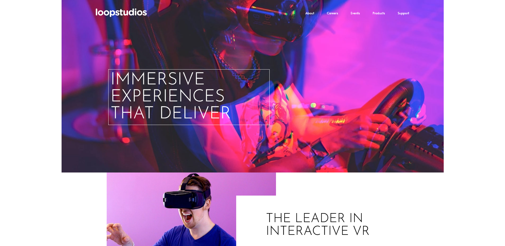

# Frontend Mentor - Loopstudios landing page solution

This is a solution to the [Loopstudios landing page challenge on Frontend Mentor](https://www.frontendmentor.io/challenges/loopstudios-landing-page-N88J5Onjw). Frontend Mentor challenges help you improve your coding skills by building realistic projects. 

## Table of contents

- [Overview](#overview)
  - [The challenge](#the-challenge)
  - [Screenshot](#screenshot)
  - [Links](#links)
- [My process](#my-process)
  - [Built with](#built-with)
  - [What I learned](#what-i-learned)
  - [Continued development](#continued-development)
  - [Useful resources](#useful-resources)
- [Author](#author)
- [Acknowledgments](#acknowledgments)

## Overview

### The challenge

Users should be able to:

- View the optimal layout for the site depending on their device's screen size
- See hover states for all interactive elements on the page

### Screenshot

### Links

- Solution URL: [https://github.com/art5551/loopstudios-landing-page-main.git](https://github.com/art5551/loopstudios-landing-page-main.git)
- Live Site URL: [https://art5551.github.io/loopstudios-landing-page-main/](https://art5551.github.io/loopstudios-landing-page-main/)

## My process

### Built with

- Semantic HTML5 markup
- CSS custom properties
- Flexbox
- CSS Grid
- Mobile-first workflow

### What I learned

Struggled a bit getting the background image stable for both mobile and desktop. Tried to utilize the picture element to easiy toggle between two modes but it wont work as a background.
Was using flex to center/justify items on screen but is not viable for ths project. Instead, started setting body width to 100% and then giving child elements a max-width and setting margin auto will center the element. Basing the child element, in this case, to the width of the supplied image, 1440px.

If you want more help with writing markdown, we'd recommend checking out [The Markdown Guide](https://www.markdownguide.org/) to learn more.

**Note: Delete this note and the content within this section and replace with your own learnings.**

### Continued development

Want to keep working on grid projects and use grid template areas.

## Author

- Website - [Arthur Stark](https://www.your-site.com)
- Frontend Mentor - [@art5551](https://www.frontendmentor.io/profile/@art5551)
- Twitter - [Akie](https://www.twitter.com/@Akie42528491)

